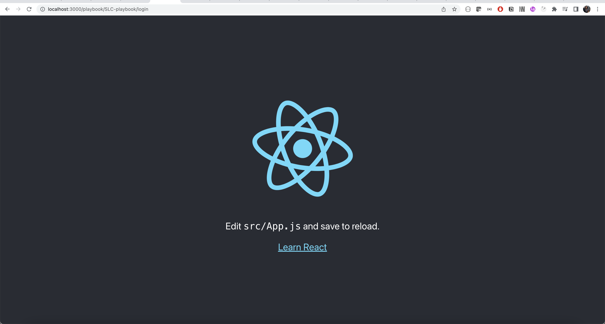
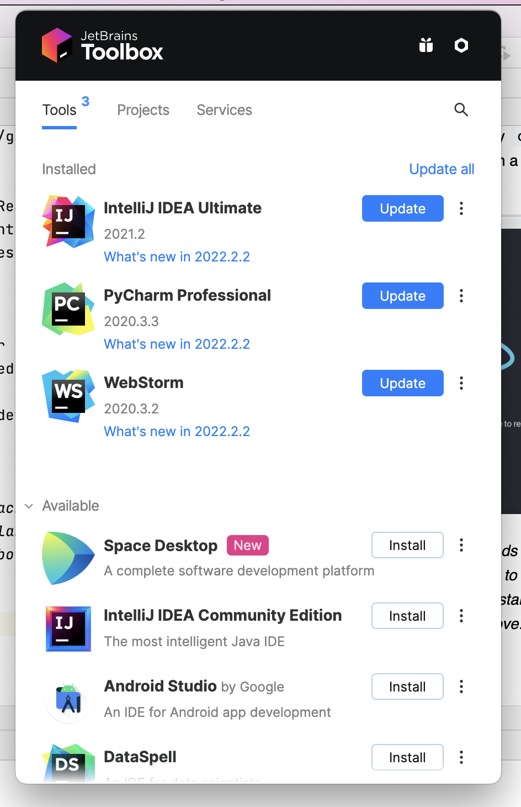
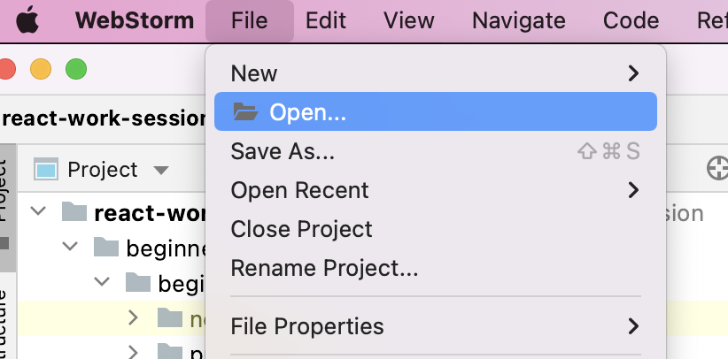
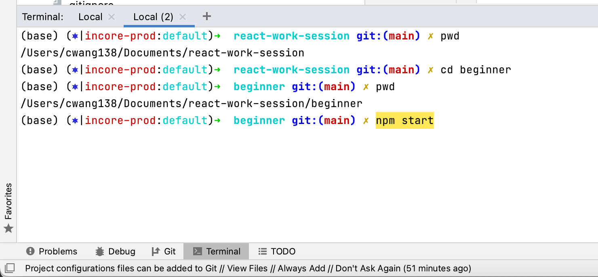
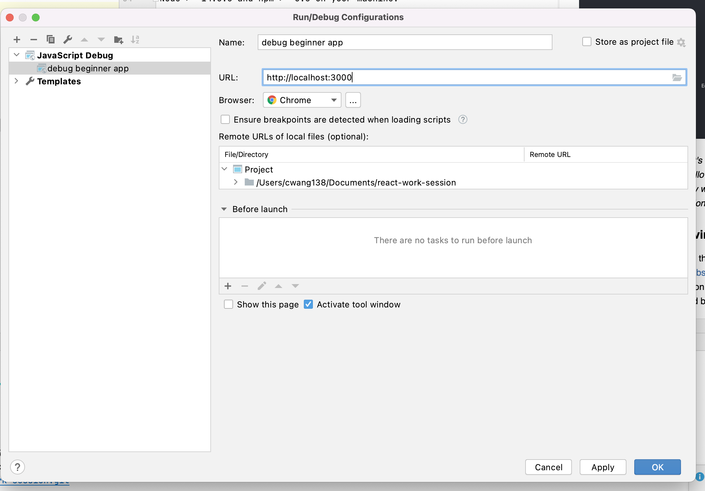
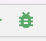
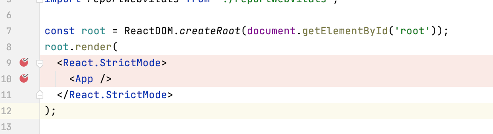
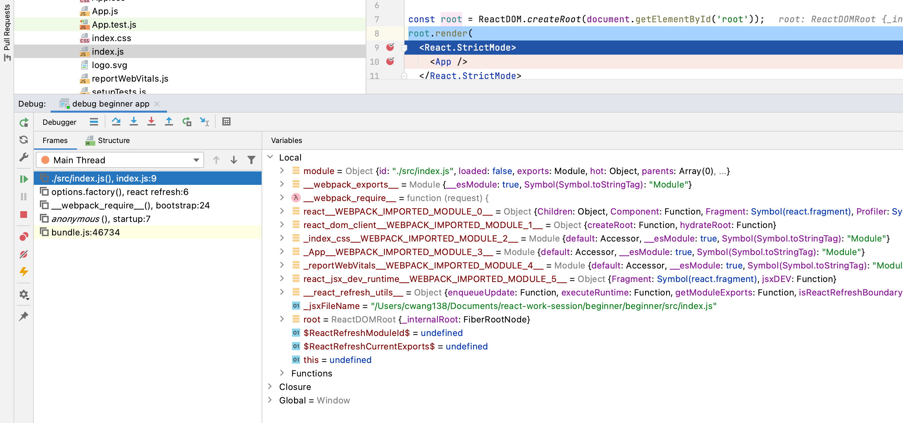

# React Work Session

## Beginner
### Install Node and NPM
Download the installer based on your platform here: https://nodejs.org/en/. Note that ideally you install **Node V14**
and **NPM >= V5.6**

To see if your installation has succeeded, in your terminal run `node -v` and `npm -v`

### Install NPM
NPM is the world's largest software registry. Open source developers from every continent use npm to share and borrow 
packages, and many organizations use npm to manage private development as well. Go to https://www.npmjs.com/ to 
explore all the available packages

NPM comes with the Node installer. If you would like to **upgrade to the latest version** of npm, on the command line, 
run the following command: `npm install -g npm`

### Install NVM (OPTIONAL)
NVM allows you to quickly install and use different versions of node via the command line. For example:
```
$ nvm use 16
Now using node v16.9.1 (npm v7.21.1)

$ nvm use 14
Now using node v14.18.0 (npm v6.14.15)
```

To install NVM, please follow the instruction here: https://github.com/nvm-sh/nvm#install--update-script

### Create React App
Create React App is a comfortable environment for learning React, and is the best way to start building a new 
single-page application in React. It sets up your development environment so that you can use the latest JavaScript 
features, provides a nice developer experience, and optimizes your app for production. You’ll need to have 
Node >= 14.0.0 and npm >= 5.6 on your machine. 

To create a project, run:
1. `npx create-react-app beginner` Note: you can change your project name by replacing the 
   `beginner` in the command. This will create a folder named `beginner` with all the needed content.
2. In your command line, enter that directory `cd beginner`
3. Start the app `npm start`. This will open a tab on your default browser at port 3000 http://localhost:3000.



*If you are curious about what's npx: NPX stands for Node Package eXecute. It is an NPM package runner. 
It allows developers to execute any Javascript Package available on the NPM registry without even installing it. 
NPX is installed automatically with NPM version 5.2.0 and above.*

### Set Development Environment
If you get license for JetBrain through NCSA, you could use Webstorm https://www.jetbrains.com/webstorm/ which is the 
preferred IDE. For convenience, this work session will use Webstorm as an example; but any text editor + command line should be enough 
for basic development.


- Open the `beginner` will load project into webstorm
  
- In the terminal, type `npm start` will start the app


To set up **Debug mode**: 
Add Configuration following the below screenshots:




When `npm start` is running in the terminal, simultaneously start the debugger by clicking the **bug**  icon. 
This will open a new tab. 

Set up break points, operate on the app and see the state.




### Start Developing

#### Preparing for the hello-world tutorial. 

We will try most of the material from https://reactjs.org/docs/hello-world.html and 
https://upmostly.com/tutorials/react-hooks-simple-introduction
If you prefer develop locally on Webstorm, following the below steps:
1. Clone this repository by `git clone https://github.com/longshuicy/react-work-session.git`
2. Enter the /beginner/hello-world folder `cd beginner/hello-world`
3. Installing dependency libraries by `npm install`
4. Run `npm start` and you should see the basic layout in **http://localhost:3000**

#### Agenda
1. [What's JSX](https://reactjs.org/docs/introducing-jsx.html)
2. [Components and props](https://reactjs.org/docs/components-and-props.html)
3. [Introduction on state and lifecycles](https://reactjs.org/docs/state-and-lifecycle.html)
   We will now try examples of class based component, instead I will just briefly explain the concept using this 
   [code](https://codepen.io/gaearon/pen/vXdGmd?editors=0010) as example
3. [Hooks](https://reactjs.org/docs/hooks-intro.html)
4. [Using State Hook](https://upmostly.com/tutorials/react-hooks-simple-introduction#using-the-state-hook)
5. [Using Effect Hook](https://upmostly.com/tutorials/react-hooks-simple-introduction#using-the-effect-hook)
